# 第三讲 malloc/free

VC6中有Small Block Heap(SBH)管理，到VC10中，SBH也归到HeapAlloc函数中操作系统负责去了。

`heap_init()`中的HeapCreate和操作系统API相关，BYTES_PER_PAGE==4096，`heap_init()`最终分配了16个header。

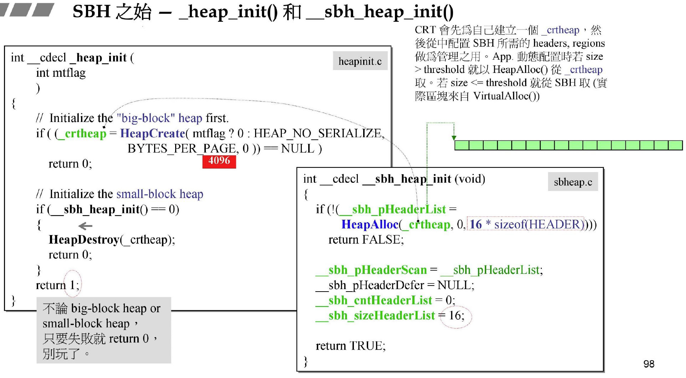

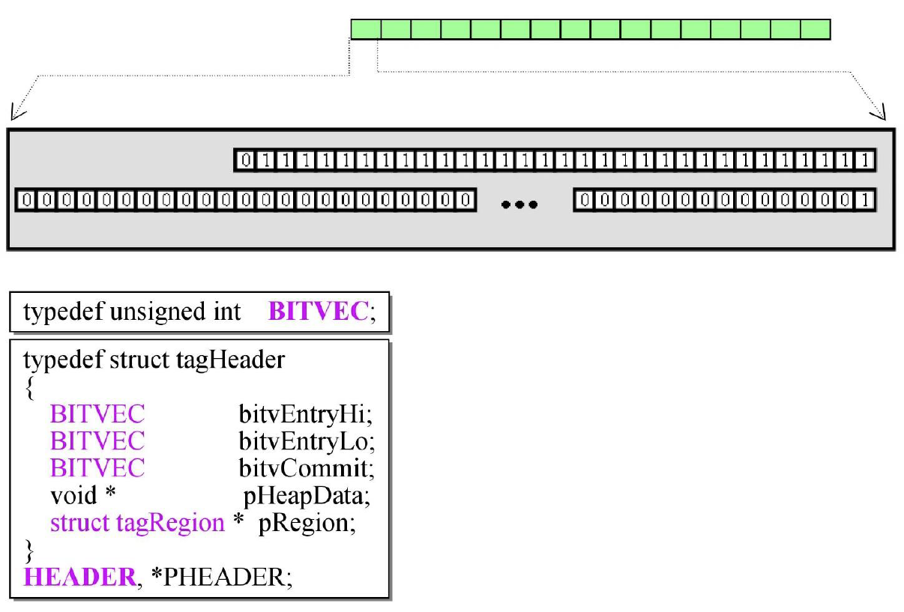

`__ioinit()`中有初次malloc: `_malloc_crt`

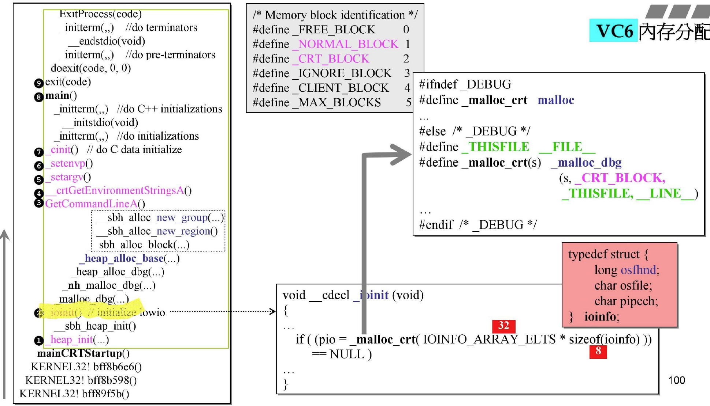 

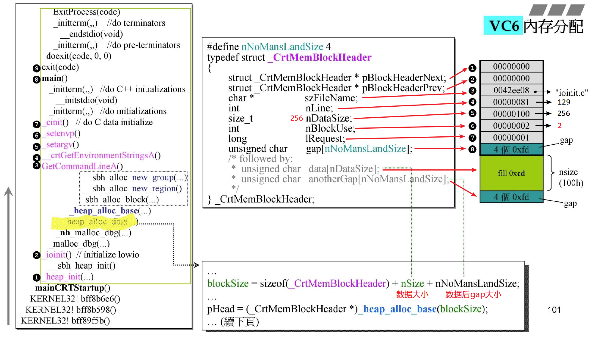

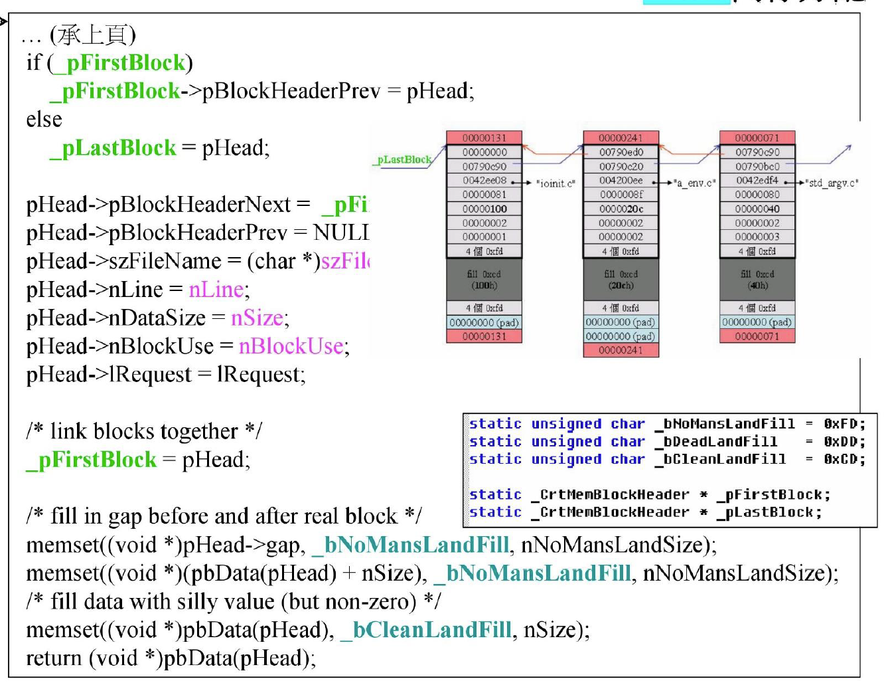

烫烫烫屯屯屯的原理就是来自于这些0xCD(屯)，0xDD(葺)，0xFD。

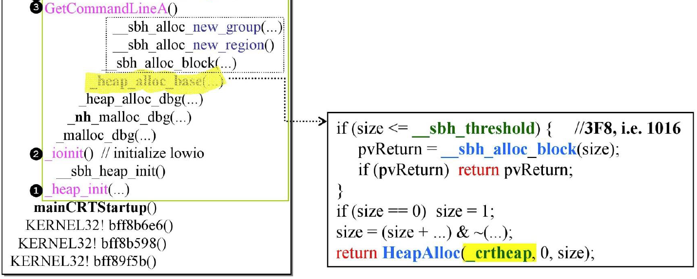

当区块block小于等于1024时，认为是小区块，交给SBH处理，这里`__sbh_threshold==0x3F8==1016`是因为size没计算上前后的两个4字节的cookie，1016+4\*2=1024。

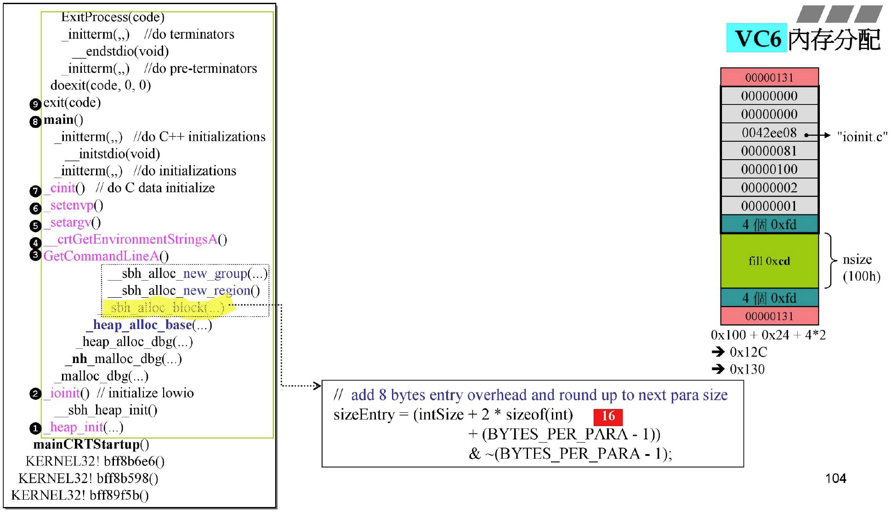

这里的`2*sizeof(int)`就是2个cookie，`(...+(BYTES_PER_PARA-1))&~(BYTES_PER_PARA-1)`是为了和`std::alloc`中类似的ROUNDUP效果，规整到16的倍数。

这里block总大小为130，cookie上记录131是因为还需要1个bit是0或1来表示这个block是在malloc手上还是已经给出去了。当这一块block还给SBH，回收的时候cookie这里会改为130。

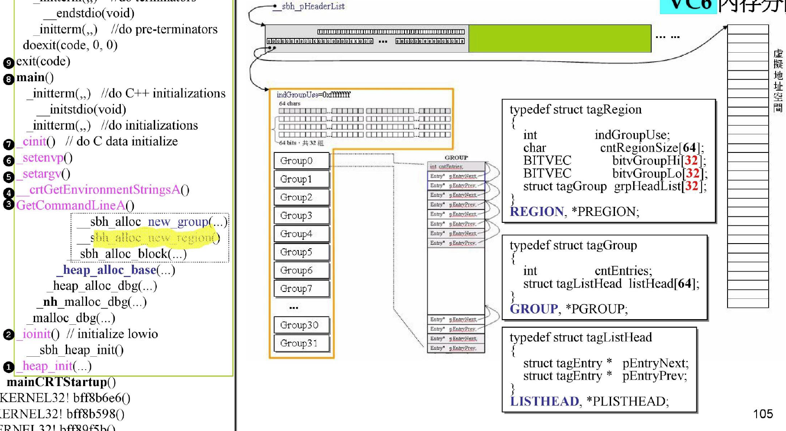

header中有两根指针，分别指向真正的内存空间(虚拟地址空间)和一个控制中心Region。

由于BITVEC是unsigned int，这里的`bitvGroupHi[32]`和`bitvGroupLo[32]`并起来就是32组64bit，用来管理哪些区块on或off，Group里的链表有没有可供管理的地址空间等。

`struct tagGroup grpHeadList[32]`中的`tagGroup`定义为：

```cpp
typedef struct tagGroup
{
    int cntEntries;
    struct tagListHead listHead[64];
}
GROUP, *PGROUP;
typedef struct tagListHead	//这将形成一个双向链表
{
    struct tagEntry *pEntryNext;
    struct tagEntry *pEntryPrev;
}
LISTHEAD, *PLISTHEAD;
```

说明一个header将会申请1M空间，用Region来管理它，Region里有32组64bits，还有32个Group，每个Group里有64个双向链表节点。这些空间消耗共有16K，也就是为了管理1M内存要额外付出16K内存。

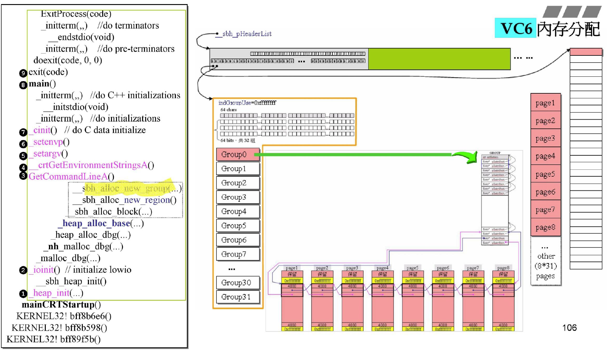

32个Group的目的是把1M分成32块来进行管理，每块大小为1024÷32=32KB，每个Group再分为8个page，每个4K。而16Bytes一般称为一个paragraph。

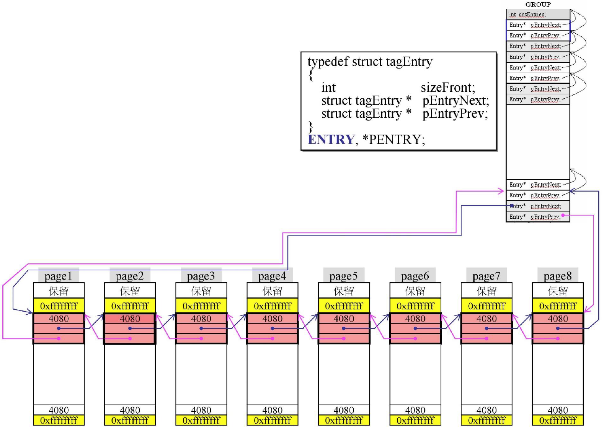

这每个page会以链表形式串起来，然后挂到group中的最后一个节点。这些0xffffffff就是-1，当这些空间回收时需要合并，合并过程里需要用这些-1作为阻隔器，表示无论怎么合并这些page之间是不能合并的。4080记录的是两个0xffffffff之间的区块大小。整个page本应为4096，减去两个0xffffffff占用的8，应为4088，但由于这里规定每个block是16倍数大小，4088不是16倍数，因此调整为4080。剩下的8就是上面的“保留”。

page的首有个prev，尾next指向GROUP数组的倒数第二个节点的pEntryPrev，由于这两根指针都是tagEntry*，解引用后包含12Bytes，这里会借用到倒数第二个节点的一部分地址，但不会有影响，因为代码中不会修改前一个节点的pEntryPrev。同样的tagEntry中的sizeFront是借用了前一个tagEntry的空间。

对于GROUP这个数组，有64个节点，第一个节点负责16字节，第二个负责32，第三个负责48...，最后一个节点负责1024字节大小的block。与`std::alloc`的free_list类似，但这里又有不同，最后一个节点不只负责1024，所有大于1K的block全部归它负责。当上图所示page被切割到单个block小于1024时，就应该由上面的节点负责了。

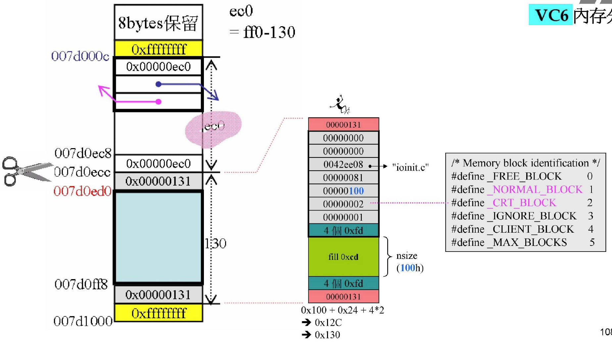

以前面的例子继续，数据端要的是100h，加上cookie和debug header调整到16边界后为130h，(4080==ff0h)-130h为ec0h。

以这个block为例，

- 前面两个00000000分别是指向前面和后面的指针
- 0042ee08表示字符串"ioinit.c"，表示发出需求的文件
- 00000081表示是由这个文件第81行发出的需求，用于debug
- 00000010表示客户要的大小
- 00000002表示`#define _CRT_BLOCK 2`中的2，表示这一块是给C Runtime Library用的，而这一栏为00000001表示`#define _NORMAL_BLOCK 1`中的1，表示这一块是在main()函数中我们自己建立的。

当main()函数运行结束后，仍然有block没释放，不一定是内存泄漏，因为这个区块是CRT所用的，此时还没结束生命周期，但如果这一栏为00000001的block还没释放，那就确实是内存泄漏。

## VC6内存管理首次分配

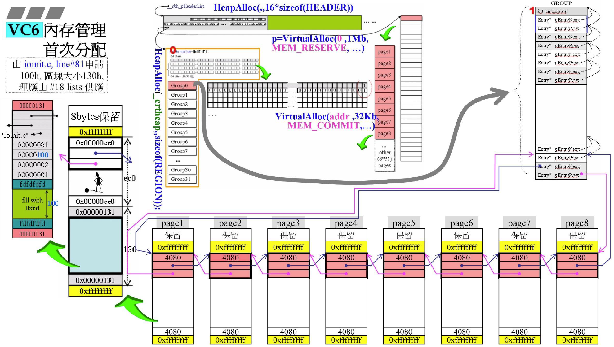

从图中可以看出，Region是由`HeapAlloc`函数去`_crtheap`处拿的，`_crtheap`默认为4096Bytes，不够会自动扩充。

而虚拟地址空间是由`VirtualAlloc`去系统内存处拿的，`VirtualAlloc`的实参中0表示随便一个地址都OK，`MEM_RESERVE`表示目前只保留这块地址空间，不需要真的有内存对应在里面。`MEM_COMMIT`表示真的要给内存。

左边浅蓝色部分表示给到客户的脱离了SBH的130h地址空间，其中fdfdfdfd是放在客户真正要的100h空间的前后的标记。在回收时，系统会检查这一块是否仍为fdfdfdfd，否则说明客户写数据时越界了。

中间的32组64bits中，第i组第j个bit为0或1表示对应的第i个Group上第j个双向链表节点是否挂有地址空间，0为否，1为有。系统通过这里得知，当需要130h区块时，对应的Group上第18号list上有没有地址空间，由于此时没有，且只有最后一号63号list上有地址空间，因此只能从这里分割130h出来。

## VC6内存管理第2次分配

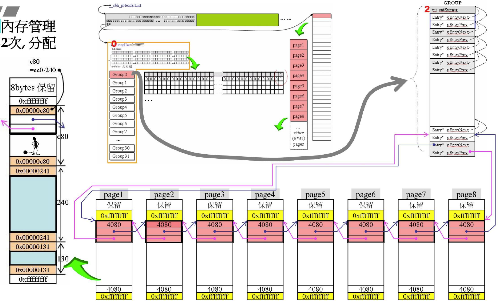

这次需要240h，理论上应该去Group上第35号(因为240h相当于576，再÷16=36，再减1)list上找地址空间，但查询32组64bits发现此处为0，因此还得去最后一号63号list上的地址空间，继续分割。

刚刚已切出来130h，剩下ec0h(3776)，继续切240h(576)，得到c80h(3200)。

`cntEntries`表示Group中给到客户的双向链表节点个数，为0时，就可以把这个group拿到的所有page还给操作系统。

`indGroupUse`为0表示目前正在用第0个Group。

## VC6内存管理第3次分配

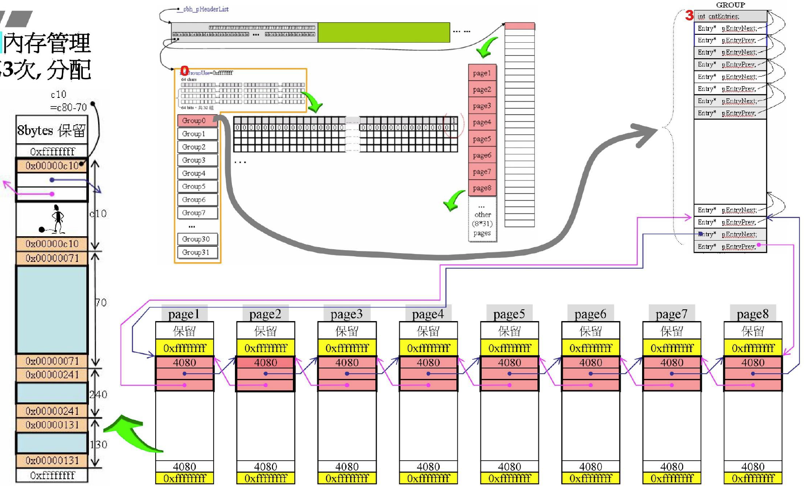

这次需要70h，c80h-70h=c10h，剩余c10h。

## VC6内存管理 第15次释放

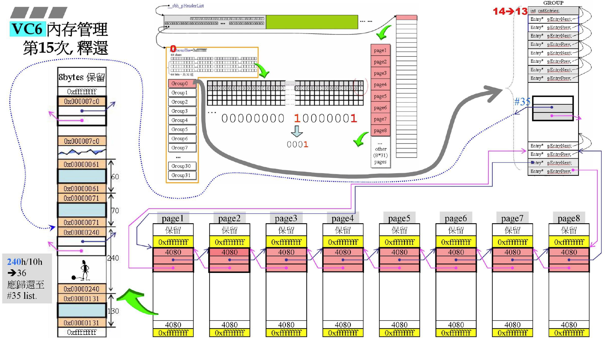

要回收240h，将240h/10h得到24h即36，应归于Group上的#35 list，并将这一块前后的0x00000241改为0x00000240，并将0x00000240后面的两个4Bytes重置为双向链表的节点的两根指针(利用union的思想，这两根指针所在地在这一块被用户拿去使用时可能被其他东西覆盖，但一旦回收就变回两根指针)。

cntEntries要自减1。Region中第一组bits变为0x00000000, 0x10000001，这里的1是十六进制的1，代表了二进制的35个0，1个1，27个0，1个1。因为将240h回收变为可用的了，控制中心Region对应位置应变为1。

## VC6内存管理 第16次分配

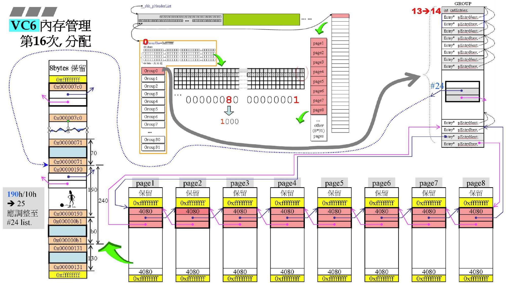


这次需要b0h，由于在Region检测到离b0h/10h=bh=11，即#10list有更近的#35list，因此不用最后一个#63 list，直接从240h上分割出b0h。

一般的原则：需要某一个大小时，会去找最接近且大于等于所需大小的Group中的双向链表节点。

剩余空间为240h-b0h=190h，190h/10h=19h=25对应到#24 list，Region中第一组bits变为0x00000080, 0x00000001，表示二进制的24个0，1个1，38个0，1个1。

## VC6内存管理 第n次分配

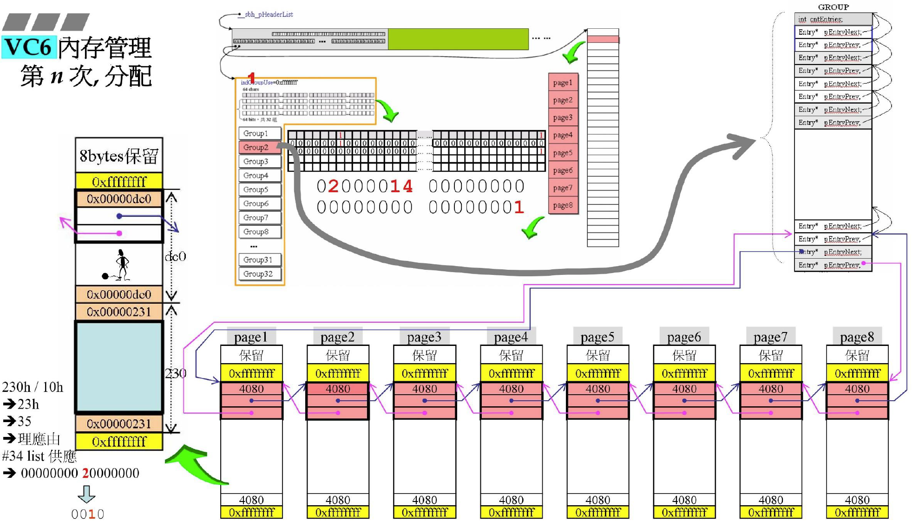

此时Group1对应的bits已经变为0x02000014, 0x00000000，说明里面有3个1，即Group1上有3个双向链表节点挂有区块。

这次需要230h，即需要挂到230h/10h=23h=35, #34 list上，Group1中挂有的任何区块都比它小。因此只能到Group2上去寻找。

此时`indGroupUse`变为1。

## VC6内存管理区块之合并

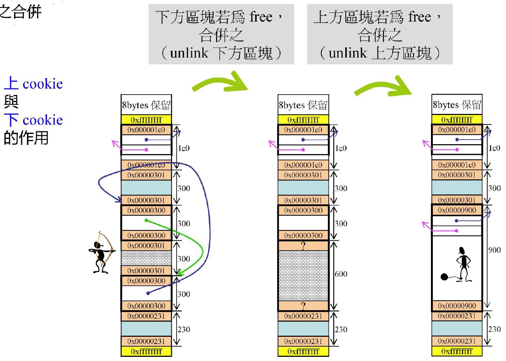

没有对回收区块进行合并，会导致系统内存越来越碎片化，无法拿到大的区块，因此需要合并回收区块。

上cookie与下cookie的作用在这一节体现出来，当某一区块被回收时，向上走1，检查上一区块该bit位是否为0，是则需要合并；同理向下走自身的长度300h，检查下一区块开头的cookie最后一个bit位是否为0，是则需要合并。

一般区块回收时会先看下面是否要合并，是则合并，然后再看上面是否要合并，是则合并。

## VC6内存管理 free(p)

回收p时，怎么查出指针p属于哪个header，哪个group上的哪个free-list？

查header方法是：通过检查指针p是否落在`__sbh_pHeaderList`解引用后得到的`void* pHeapData`指向的虚拟地址空间的1MB中，即指针p是否大于这块虚拟地址空间开头，小于结尾，是则证明落在这个header上，否则`__sbh_pHeaderList`继续向前走检查下一个header。

查group方法是：将(指针p减去该header指向虚拟地址空间的开头)除以一段的长头即32K，就知道指针p落在第几个group。

查free-list方法是：指针p能看到自己对应区块的cookie，将自己的大小除以16就可以得到在哪个free-list。

为什么要将获得的系统内存这样分段管理？是为了便于判断某一段是否全回收，这样可以还给操作系统。

如何判断一个Group能否全回收？当cntEntries为0时，此时Group中所有的区块都合并为8个page(因为每次回收都会检查能否合并)，8个page都挂在最后一个free-list上，就可以预备回收，但不马上回收，因为可能下一次就需要这个Group，因此当有下一个Group全回收时，再调用VirtualFree回收当前Group。

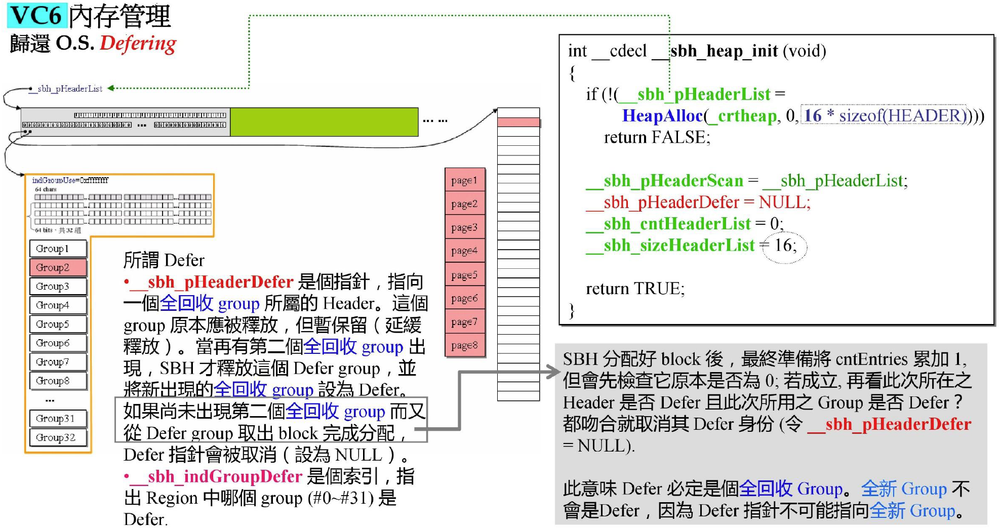

`__sbh_heap_init`函数中：

- `__sbh_pHeaderDefer`这个指针就指向某个已全回收的Group所属的Header，待有第二个全回收Group出现，SBH才释放这个Defer Group，并将新出现的全回收Group所属Header设为Defer。若尚未出现第二个全回收Group又从Defer Group取出block进行分配，那Defer指针会被重新置为NULL。
- `__sbh_indGroupDefer`是个索引，指出Header对应Region中哪个Group(#0~#31)是Defer。

## VC6 + GCC allocator

GCC allocator采用如此架构的原因主要不是为了减少malloc次数，而是为了尽可能减少cookie。因为malloc本身已经很快。

## 重复进行内存管理的必要性

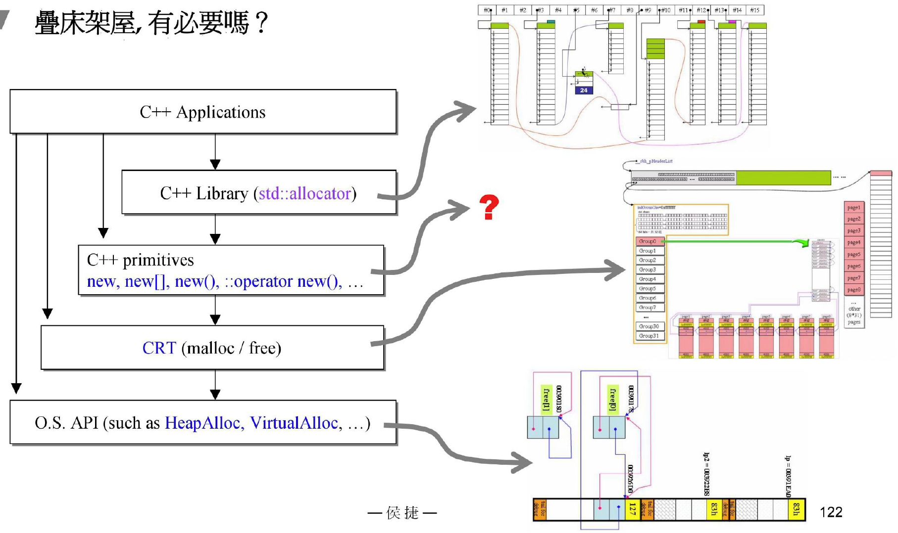

因为每个层次都不能假设自己下面的层次做了内存管理，因此每个层次都有自己一套内存管理的理念，这是有必要的。比如VC10中malloc/free就没有采用SBH的管理方式，而是直接调用HeapAlloc，将内存管理交给操作系统的API。
