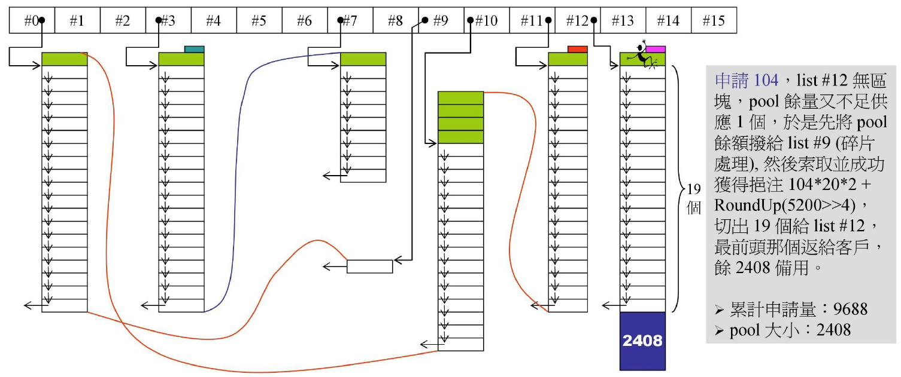
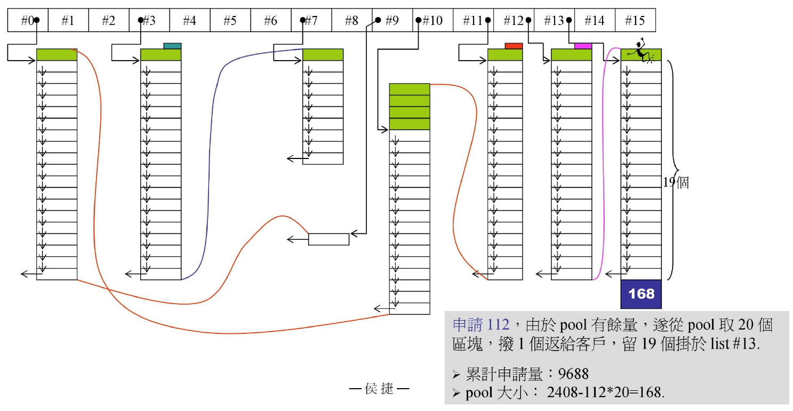
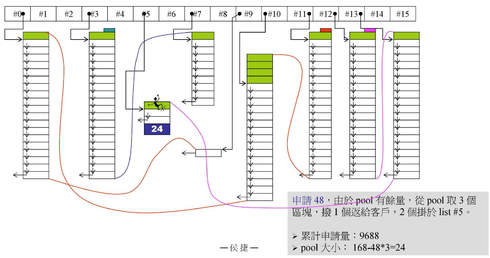
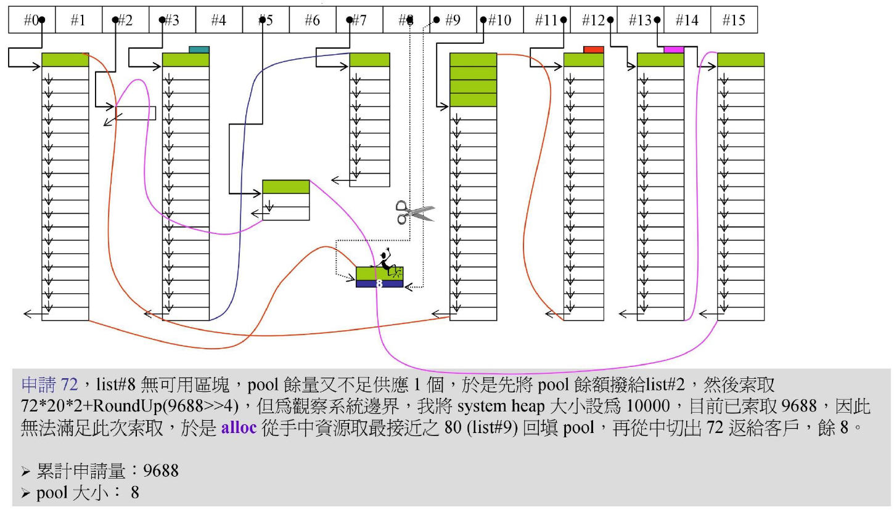
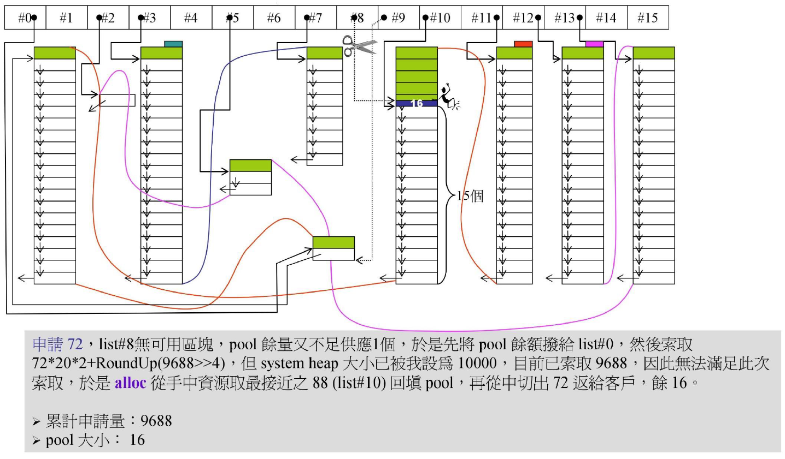
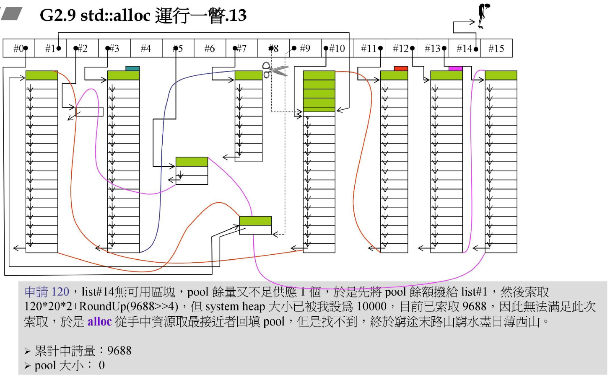
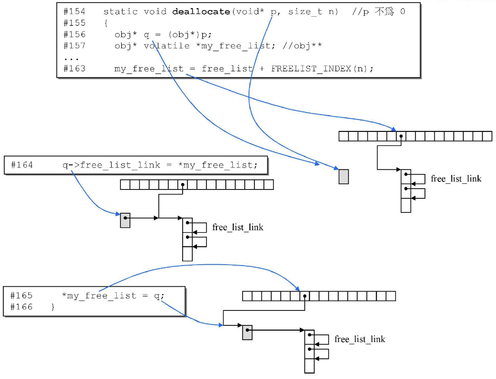

# 第二讲 std::allocator

## VC6 malloc()

尝试去除cookie

## VC6标准分配器之实现

VC6中的allocator中没有做任何内存管理，只是简单地调用`operator new`，`operator new`中调用了`malloc`。

## BC5标准分配器之实现

BC5中的allocator和VC6中的类似。

## GCC2.9标准分配器之实现

GCC2.9的std::allocator也是直接调用::operator new和::operator delete。

## GCC4.9标准分配器之实现

GCC4.9的std::allocator也是直接调用::operator new和::operator delete。

## GCC2.9的std::alloc与GCC4.9的__pool_alloc


GCC2.9容器使用的分配器，不是std::allocator而是std::alloc。

std::alloc中的`allocate`和`deallocate`都是静态成员函数，接收的值是字节数而非单元(如int, double)数。

在GCC4.9中的`__gnu_cxx::__pool_alloc<T>`就是GCC2.9的`std::alloc`。

## GCC2.9 std::alloc 运行模式

有一个类alloc，里面维护着free_list[16]，这个数组中每个位置放着一个指针，代表一个链表的开头，第i个位置代表8*(i+1)大小的元素的分配所在地，若元素大小不是8的倍数，就向上对齐到8的倍数，一次挖40个元素大小的空间+Roundup(之前累计申请空间量>>4)，其中20个用来切割放当前元素，另外一半作为备用。下一次需要别的大小的批量元素分配时，可优先从这备用池pool里取空间，若备用空间已用完，就重新挖40个当前元素大小的空间，一半用来切割放当前元素，另外一半作为备用。


图中每一个小区块就是元素的大小，绿色的是已经分配给客户的，把链表中的指针覆盖掉了，白色是尚未分配的空间。这种小区块的使用方法：

```cpp
union obj{
    union obj* free_list_link;
};
```

或

```cpp
struct obj{
    obj* free_list_link;
};
```

当然，元素本身大小必须大于等于4，才能被借用来做指针。

## GCC2.9 std::alloc运行一瞥(图上文字说明在下)

start_free和end_free两根指针之间的内存就是备用池。

对于free_list而言，每次申请空间，其实是先挖size\*20\*2的空间到备用池中来，然后再从其中拿出一半用来切割给元素。

 从备用池中切出来准备挂上free list的区块，数量永远在1~20之间。

当备用池pool无余量时，需要获取96\*20\*2+Roundup(1280(之前累计申请空间量)>>4)=3920，Roundup是追加量。



8. 当备用池有余量但不够新申请元素一个大时，将余量分配给对应大小的位置，比如备用池余量为80，新申请元素大小为104，那么将余量80分配给位置#9。这一段称为**碎片处理**。然后再新申请104\*20\*2+Roundup(5200>>4)=4485再对齐到4488的大小，因此现在累计申请量为5200+4488=9688，备用池pool大小为4488-104\*20=2408。



9. 再申请112大小的元素，从备用池拿出112\*20，构造20个元素的链表挂在#13，备用池剩下168。



10. 再申请大小为48的元素，从备用池拿出3*48=144，构造3个元素的链表挂在#5，备用池pool剩余24，此时累计申请量为9688。



11. 当系统内存不足时，如假设系统内存只有10000，再申请大小为72的元素，先将剩余的24字节挂到位置#2，再将最接近且大于72的已有资源即位置#9上的剩余的一个80放回pool，从中切出72给用户，挂到位置#8，此时备用池剩余为8bytes。



12. 接下来再申请大小为72的元素，假如位置#10的元素大小为88的列表的20个位置没全部用掉，归还1个位置=88bytes中的72bytes给备用池pool，备用池再分配给用户，分配72\*1bytes给一个72元素，剩下的放进备用池pool。



13. 再申请大小为120的元素，这次无法申请到了。

举例：当这个分配器最多从系统拿走了100万的内存，之后释放了90万，但握在std::alloc手中的仍然是100万的空间，不会返还给系统。从程序本身看，这个分配器只获取空间而不返还给操作系统空间，是一个好事，因为虽然没有返还，但空闲空间会返回到std::alloc手中作为备用空间。从多线程的角度看，这个特点就不好，对其他程序运行 有影响。

## GCC2.9 std::alloc 源码剖析

### 第二级分配器`__default_alloc_template`

```cpp
//实际上应使用static const int x = N
//取代以下的enum{ x = N }，但目前支持该性质的编译器不多
enum { __ALIGN = 8 };						//小区块的上调边界
enum { __MAX_BYTES = 128 };					//小区块的上限
enum { __NFREELISTS = __MAX_BYTES/__ALIGN };//freelist个数
template<bool threads, int inst>
class __default_alloc_template {
private:
	//以bytes==13为例，则(13+7) & ~7，即 10100 & 11000，得10000，即16，目的是取最接近的16倍数
	static size_t ROUND_UP(size_t bytes) {
		return ((bytes + __ALIGN - 1) & ~(__ALIGN - 1));
	}
private:
	union obj {	//type definition
		union obj* free_list_link;
	};	//改用struct亦可
private:
	static obj* volatile free_list[__NFREELISTS];
	//目的：假设所取元素大小为n，找到free_list中(n+7)/8 - 1的位置挂上
	//若bytes为8，则结果为#0
	//若bytes为20，则结果为#2
	//若bytes为24，则结果为#2
	static size_t FREELIST_INDEX(size_t bytes) {
		return ((bytes + __ALIGN - 1) / __ALIGN - 1);
	}

	//Returns an object of size n, and optionally adds to size n free list.
	//即充值空间函数
	static void* refill(size_t n);

	//Allocates a chunk for nobjs of size "size".
	//if it is inconvenient to allocate the requested number.
	//即要一大块空间的函数
	static char* chunk_alloc(size_t size, int& nobjs);

	//Chunk allocation state.
	static char* start_free;	//指向备用池的头
	static char* end_free;		//指向备用池的尾
	static size_t heap_size;	//分配空间累计量
public:
	static void* allocate(size_t n)	//n must be > 0
	{
		obj* volatile* my_free_list;	//obj**
		obj* result;

		if (n > (size_t)__MAX_BYTES) {	//改用第一级
			return malloc_alloc::allocate(n);
		}

		//free_list是obj*[]数组，经由FREELIST_INDEX()函数算出应访问该数组的第几个位置即偏移量，加到数组头free_list上
		my_free_list = free_list + FREELIST_INDEX(n);
		//对obj**解引用得到obj*，即指向该位置链表开头的指针
		result = *my_free_list;
		if (result == 0) {	//若list为空
			//refill()会填充free list并返回第一个区块的起始地址
			//若备用池有空间，从备有池拿，否则用malloc拿
			void* r = refill(ROUND_UP(n));
			return r;
		}//若向下进行说明list内已有可用区间，free_list_link指向的就是可用空间
		*my_free_list = result->free_list_link;
		return result;
	}

	//如果这个p并非当初从std::alloc取得，仍可并入alloc内，若p所指大小不是8倍数，会引发灾难
	static void deallocate(void* p, size_t n)	//p不为0
	{
		obj* q = (obj*)p;
		obj* volatile* my_free_list;	//obj**

		//若该指针指向的空间是由第二级空间分配器创建，那么由第二级回收，否则交给第一级空间配置器回收
		if (n > (size_t)__MAX_BYTES) {
			malloc_alloc::deallocate(p, n);	//改用第一级
			return;
		}
		//以下部分简单来讲就是将p或者说q所指向节点，插到原obj*指针*my_free_list指向的链表开头之前，作为新的链表开头
		my_free_list = free_list + FREELIST_INDEX(n);
		q->free_list_link = *my_free_list;
		*my_free_list = q;
	}

	static void* reallocate(void* p, size_t old_sz, size_t new_sz);	//此处略列
	// --------------------------------------------------------------------
	// We allocate memory in large chunks in order to avoid fragmenting the
	// malloc heap too much. We assume that size is properly aligned.
	// We hold the allocation lock.
	// --------------------------------------------------------------------
};
template <bool threads, int inst>
char* __default_alloc_template<threads, inst>::
chunk_alloc(size_t size, int& nobjs)
{
	char* result;
	size_t total_bytes = size * nobjs;
	size_t bytes_left = end_free - start_free;

	
	if (bytes_left >= total_bytes) {//若pool空间满足20块要求
		result = start_free;
		start_free += total_bytes;	//将start_free向后挪动，缩小备用池pool
		return result;
	}
	else if (bytes_left >= size) {	//pool空间只足以满足一块或以上的需求
		nobjs = bytes_left / size;	//改变需求数
		total_bytes = size * nobjs;	//改变需求总字节量
		result = start_free;
		start_free += total_bytes;	//将start_free向后挪动，缩小备用池pool
		return result;
	}
	else {							//pool空间不足以满足一块需求
		size_t bytes_to_get =		//现在打算获取系统空闲内存来加注备用池pool
			2 * total_bytes + ROUND_UP(heap_size >> 4);//更好的方式: 声明在start_free调用它前
		//首先尝试将pool做充分运用
		if (bytes_left > 0) {		//如果pool还有空间
			//找出并转移到第#号free-list(区块尽可能大)
			obj* volatile* my_free_list = free_list + FREELIST_INDEX(bytes_left);
			//将pool空间编入第#号free-list(肯定只成1区块)的开头
			((obj*)start_free)->free_list_link = *my_free_list;
			*my_free_list = (obj*)start_free;
		}
		start_free = (char*)malloc(bytes_to_get);	//从系统空闲内存空间取这么多，注入pool
		if (0 == start_free) {						//若空闲空间不足，失败！尝试从free-list找区块
			int i;
			obj* volatile* my_free_list, * p;	//注意: 这里my_free_list是obj**，而p是obj*
			//Try to make do with what we have. That can't hurt.
			//We do not try smaller request, since that tends
			//to result in disaster on multi-process machines.
			for (i = size; i <= __MAX_BYTES; i += __ALIGN) {
				my_free_list = free_list + FREELIST_INDEX(i);
				p = *my_free_list;
				if (0 != p) {	//该free-list内有可用区块，以下释放出一块(only)给pool
					*my_free_list = p->free_list_link;
					//把free-list目前的第一块当成备用池pool
					start_free = (char*)p;
					end_free = start_free + i;
					return chunk_alloc(size, nobjs);	//递归再试一次
						//此时的pool定够供应至少一个区块
						//而任何残余零头终将被编入适当free-list					
				}
			}
			end_free = 0;	//至此，表示内存已山穷水尽
							//改用第一级，看看oom-handler能否尽点力
			start_free = (char*)malloc_alloc::allocate(bytes_to_get);
				//这会导致抛出异常，或导致内存不足的情况得到改善
		}
		//至此，表示已从系统空闲内存空间取得很多内存
		heap_size += bytes_to_get;	//累计总分配量
		end_free = start_free + bytes_to_get;	//加注pool(调整尾端)
		//这个递归正常最多只再走一次
		return chunk_alloc(size, nobjs);		//递归再试一次
	}
}

// Returns an object of size n, and optionally adds to size n free list.
// We assume that n is properly aligned. We hold the allocation lock.
// -------------------------------------------------
template <bool threads, int inst>
void* __default_alloc_template<threads, inst>::
refill(size_t n)	//默认n已调整至8的倍数
{
	int nobjs = 20;	//预设取20个区块(但不一定能)
	char* chunk = chunk_alloc(n, nobjs);	//nobjs是引用传递，也就是说函数内部可以改变nobjs，传回来的不一定是20个区块
	obj* volatile* my_free_list;	//obj**
	obj* result;
	obj* current_obj;
	obj* next_obj;
	int i;
	//若只有1个，不需要进行切割，直接把这块给客户
	if (1 == nobjs) return chunk;	//实际得1，交给客户
	//以下开始将所得区块挂上free-list
	my_free_list = free_list + FREELIST_INDEX(n);
	//在chunk内建立free-list
	result = (obj*)chunk;
	*my_free_list = next_obj = (obj*)(chunk + n);
	for (i = 1;; ++i) {
		current_obj = next_obj;
		//所谓切割就是将指针所指处转型为obj，再取其next_obj指针继续行事
		next_obj = (obj*)((char*)next_obj + n);
		if (nobjs - 1 == i) {	//最后一个的free_list_link置为0
			current_obj->free_list_link = 0;
			break;
		}
		else {
			current_obj->free_list_link = next_obj;
		}
	}
	return result;
}
//-------------------------------------------------
//这些严格叫静态变量的定义，而不是设初值
template<bool threads, int inst>
char* __default_alloc_template<threads, inst>::start_free = 0;

template<bool threads, int inst>
char* __default_alloc_template<threads, inst>::end_free = 0;

template<bool threads, int inst>
size_t __default_alloc_template<threads, inst>::heap_size = 0;

template<bool threads, int inst>
__default_alloc_template<threads, inst>::obj* volatile
__default_alloc_template<threads, inst>::free_list[__NFREELISTS] = { 0, 0, 0, 0, 0, 0, 0, 0, 0, 0, 0, 0, 0, 0, 0, 0, };
//-------------------------------------------------

//令第2级分配器的名称为alloc
typedef __default_alloc_template<false, 0> alloc;
```



## GCC2.9 std::alloc缺点

std::alloc有个先天缺陷，就是`deallocate()`没有将内存还给操作系统，这个问题主要是因为free_list中原本的链表头没有保存下来，已经无法找到，即使原申请的20个小块空间都空了下来，也无法删除回收。

## GCC4.9 pool allocator运行观察

使用`__pool_alloc`：

```cpp
template<typename T>
using listPool = list<T, __gnu_cxx::__pool_alloc<T>>;

//reset countNew
countNew = 0;
timesNew = 0;

listPool<double> lst;
for(int i = 0; i < 1000000; ++i){
    lst.push_back(i);
}
cout << "::countNew= " << ::countNew << endl;//分配空间: 16752832
cout << "::timesNew= " << ::timesNew << endl;//调用malloc次数: 122
```

使用默认分配器：

```cpp
//reset countNew
countNew = 0;
timesNew = 0;

list<double> lst;
for(int i = 0; i < 1000000; ++i){
    lst.push_back(i);
}
cout << "::countNew= " << ::countNew << endl;//分配空间: 16000000
cout << "::timesNew= " << ::timesNew << endl;//调用malloc次数: 1000000
