# 第五讲 other issues

## GNU C++对于Allocator的描述

标准分配器虽然不一定快，但是它是最适合于在不同平台上移植的。

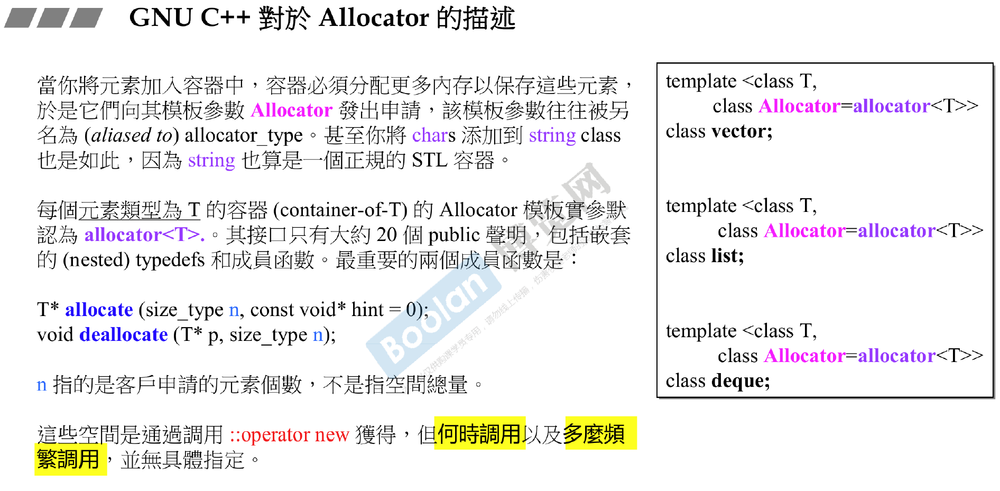

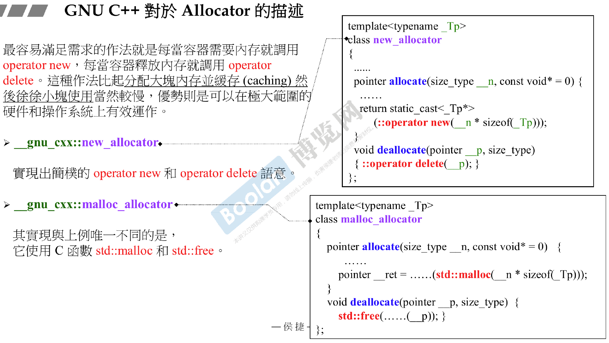

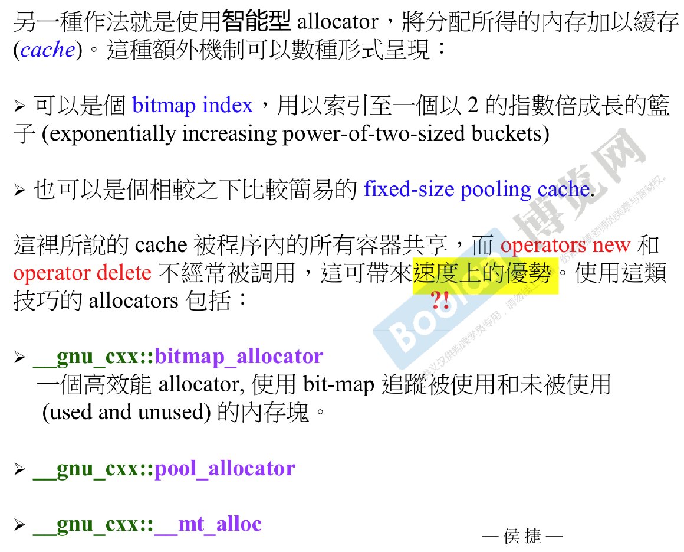

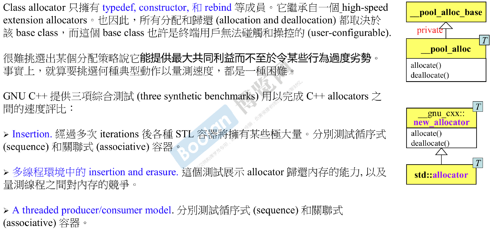

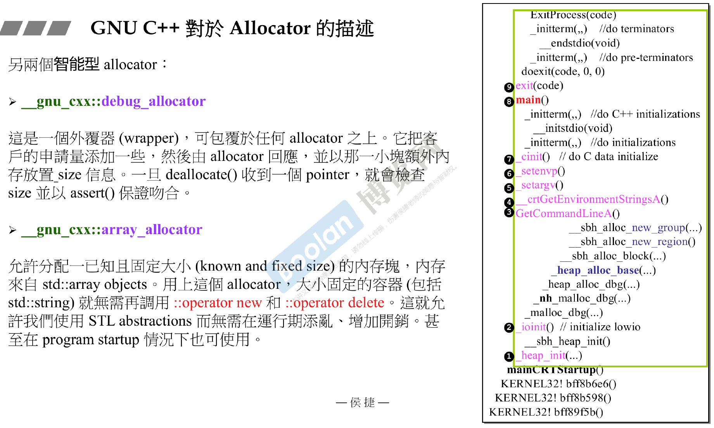

## GCC4.9 array_allocator

由于这个分配器不是在堆上获取空间，所以不需要归还操作系统内存，尽管如此，这个分配器也有`deallocate()`以满足API要求，但这个函数里不做任何事。用法示例：

```cpp
using namespace std;
using namespace std::tr1;
using namespace __gnu_cxx;

const size_t length = 65536;
int my[length];
array_allocator<int, array<int, length>> myalloc(&my);

int *p1 = myalloc.allocate(1);
int *p2 = myalloc.allocate(3);
myalloc.deallocate(p1);	//无操作
myalloc.deallocate(p2);	//无操作
```

```cpp
using namespace std;
using namespace std::tr1;
using namespace __gnu_cxx;

typedef ARRAY std::array<int, 65536>;

ARRAY* pa = new ARRAY;

array_allocator<int, ARRAY> myalloc(pa);

int *p1 = myalloc.allocate(1);
int *p2 = myalloc.allocate(3);
myalloc.deallocate(p1);	//无操作
myalloc.deallocate(p2);	//无操作

delete pa;
```

## GCC4.9 bitmap_allocator

```cpp
template<typename _Tp>
class bitmap_allocator: private free_list{
...
public:
    pointer allocate(size_type __n){
        if(__n > this->max_size())
            std::__throw_bad_alloc();
        if(__builtin_expect(__n==1, true))
            return this->_M_allocate_single_object();
        else{
            const size_type __b = __n * sizeof(value_type);
            return reinterpret_cast<pointer>(::operator new(__b));
        }
    }
    void deallocate(pointer __p, size_type __n) throw() {
        if(__builtin_expect(__p != 0, true)){
            if (__builtin_expect(__n == 1, true))
                this->_M_deallocate_single_object(__p);
            else
                ::opeartor delete(__p);
        }
    }
}
```

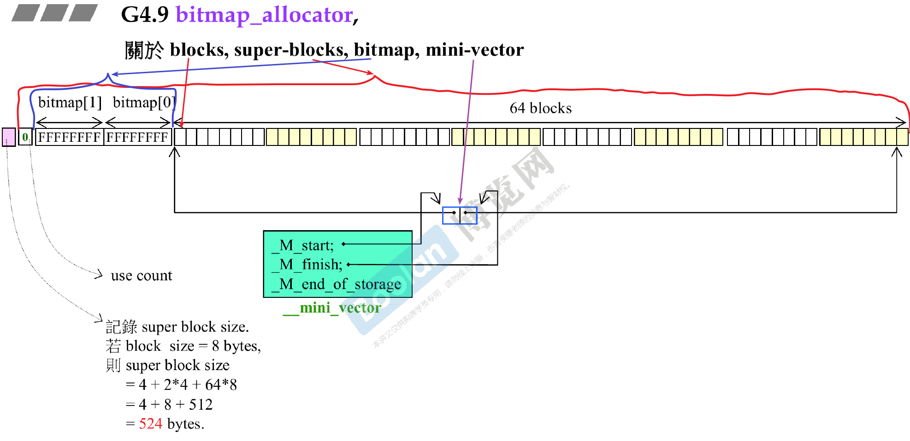

图中左边的0是useCount，表示已用的block数量。

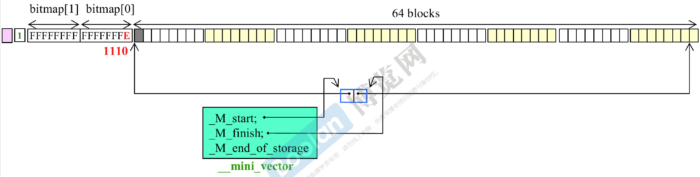

bitmap的变化次序正好和block的变化次序相反。block从左往右数就是bitmap从右往左数，因此第一个block被占用，bitmap的最后一个1变0。


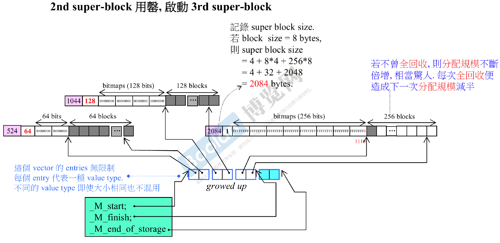

不同的类型如int和float即使大小相同，也不会放在同一个superblock里。

## 1st super-block全回收

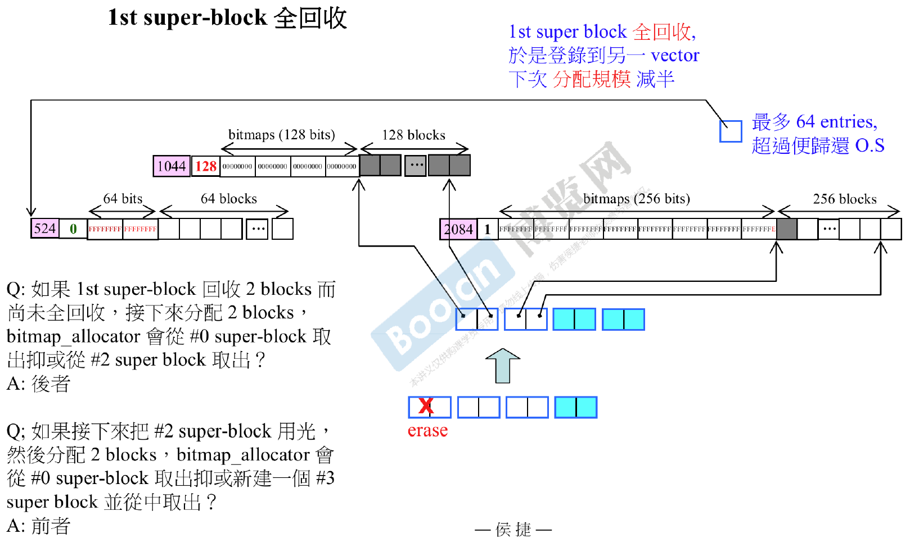

当1st super-block全回收后，就用另一个本质为mini-vector名为freelist的东西记录它，原来的minivector上控制它头尾的指针断开，另外下次分配superblock时分配规模减半而不再是增加一倍。

另外freelist最多只能记录64个全回收的superblocks，一旦超过64超过的superblock就会归还操作系统。

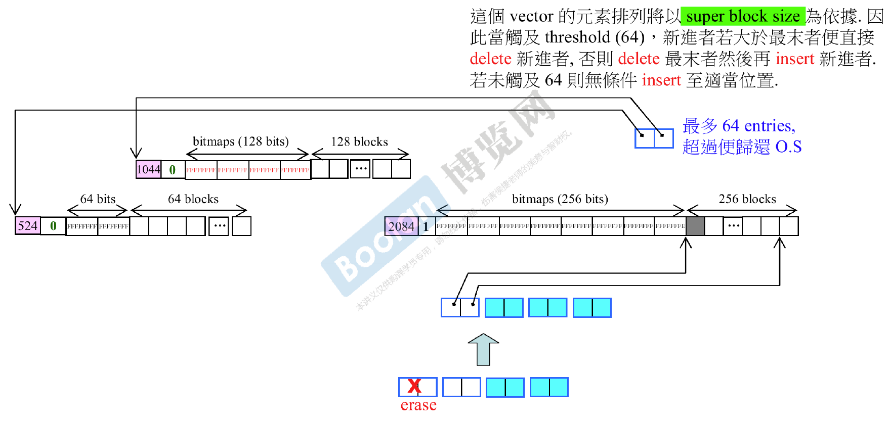在freelist中的位置是按照superblock的大小来排列的。

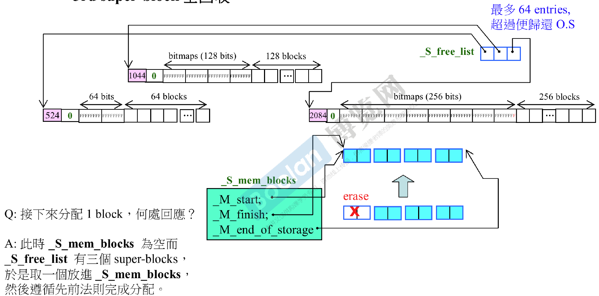

## 谈谈const

const对象不能调用非const成员函数，因此写类的成员函数时应当同时写const版本和非const版本，否则一旦用该类实例化const对象，就无法调用成员函数。

`std::string`底部采用了引用计数的功能，当用赋值操作符和拷贝构造时，其实是创建了当前字符串的另外几个引用，直到要对这些用赋值操作符或拷贝构造构建的新对象被修改时，才会真的创建一个新的副本供修改。

当成员函数的const和non-const版本同时存在，const对象只能调用const版本，non-const对象只能调用non-const版本。

## basic_string 使用new(extra)扩充申请量

这是一个典型的重载`operator new`的样例。

```cpp
template<...>
class basic_string
{
private:
    struct Rep{
        ...
        void release() { if (--ref == 0) delete this; }
        inline static void* operator new(size_t, size_t);
        inline static void operator delete(void *);
        inline static Rep* create (size_t);
        ...
    };
    ...
};
```

以这个create函数为例：

```cpp
template<class T, class traits, class Allocator>
inline basic_string <charT, traits, Allocator>::Rep* basic_string<charT, traits, Allocator>::Rep::create(size_t extra)
{
	extra = frob_size(extra + 1);
    Rep *p = new(extra)Rep;
    ...
    return p;
}
```

由于需要在申请的string内容空间前多申请一包空间用来进行引用计数Rep，因此需要重载`operator new`以多申请extra字节的空间。

```cpp
template<class T, class traits, class Allocator>
inline void* basic_string <charT, traits, Allocator>::Rep::operator new(size_t s, size_t extra)
{
    return Allocator::allocate(s + extra * sizeof(charT));
}
template<class charT, class traits, class Allocator>
inline void* basic_string <charT, traits, Allocator>::Rep::operator delete(void* ptr)
{
    Allocator::deallocate(ptr, sizeof(Rep) + reinterpret_cast<Rep*>(ptr)->res * sizeof(charT));
    
```

