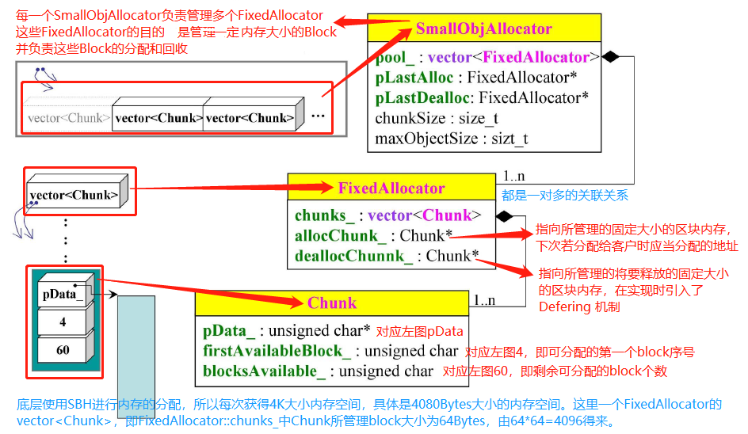
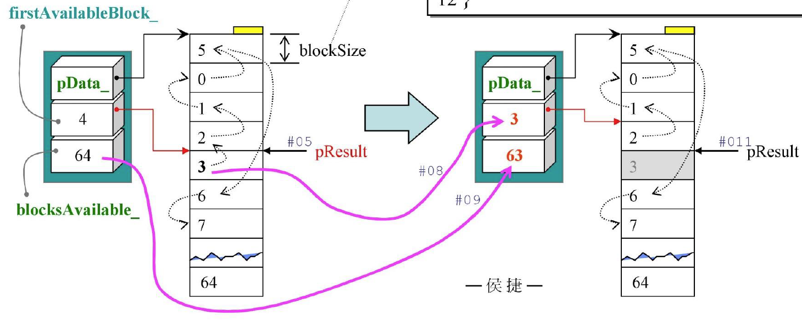
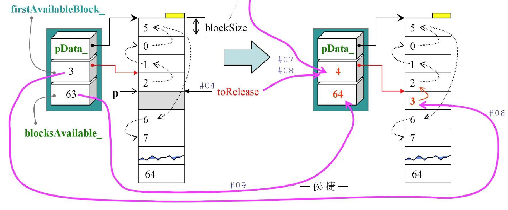
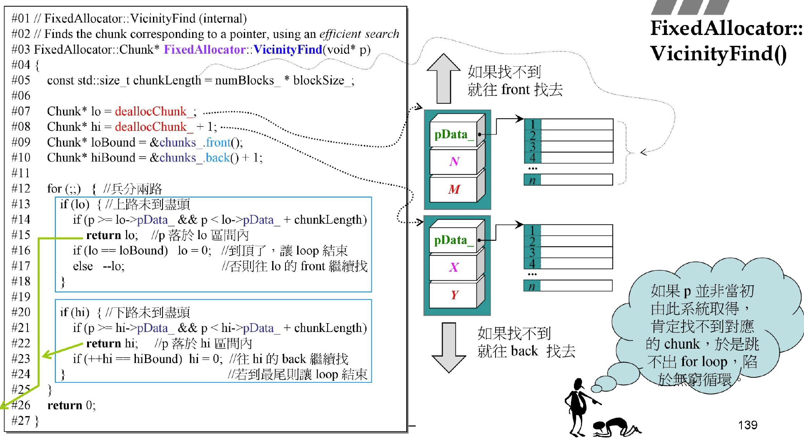

# 第四讲 loki::allocator



```cpp
struct Chunk{
	unsigned char* pData_;
    unsigned char firstAvailableBlock_;
    unsigned char blocksAvailable_;
};
struct FixedAllocator: Chunk{
    vector<Chunk> chunks_;
    Chunk* allocChunk_;
    Chunk* deallocChunk_;
};
struct SmallObjAllocator: FixedAllocator{
    vector<FixedAllocator> pool_;
    FixedAllocator* pLastAlloc;
    FixedAllocator* pLastDealloc;
    size_t chunkSize;
    size_t maxObjectSize;
};
```

`pData_`指向区块的开头，`firstAvailableBlock`是个索引表示第一个可用区块是第几个，`blocksAvailable_`表示目前还可以供应多少个区块。

`allocChunk_`和`deallocChunk_`会指向`chunks_`中的某两个Chunk。

`pLastAlloc`和`pLastDealloc`也是指向`pool_`中的某两个FixedAllocator。

## Loki allocator, Chunk

```cpp
void FixedAllocator::Chunk::Init(std::size_t blockSize, unsigned char blocks)
{
    pData_ = new unsigned char[blockSize * blocks];
    Reset(blockSize, blocks);
}
```

```cpp
void FixedAllocator::Chunk::Reset(std::size_t blockSize, unsigned char blocks)
{
    firstAvailableBlock_ = 0;
    blocksAvailable_ = blocks;
    
    unsigned char i = 0;
    unsigned char *p = pData_;
    for (;i != blocks; p += blockSize)//流水号标示索引
        *p = ++i;
}
```

```cpp
void FixedAllocator::Chunk::Release()
{
    delete[] pData_;	//释放自己
}//此函数被上一层调用
```

## Chunk::allocate



```cpp
void* FixedAllocator::Chunk::Allocate(std::size_t blockSize)
{
    if (!blocksAvailable_) return 0;	//此地无银
    //指向第一个可用区块
    unsigned char* pResult = pData_ + (firstAvailableBlock_ * blockSize);
    firstAvailableBlock_ = *pResult;//右侧索引就是下一个可用区块
    --blocksAvaiable_;
    
    return pResult;
}
```

`blocksAvaiable_`自减1，`firstAvailableBlock_`指向下一个可用区块。因为用到了最高优先权的块，接下来只能用下一个块(上图左即3指向的2)。

## Chunk::Deallocate()



```cpp
void FixedAllocator::Chunk::Deallocate(void* p, std::size_t blockSize)
{
    unsigned char* toRelease = static_cast<unsigned char*>(p);
    *toRelease = firstAvailableBlock_;
    firstAvaiableBlock_ = static_cast<unsigned char>((toRelease-pData_)/blockSize);
    ++blocksAvailable_;	//可用区块加1
}
```

寻找指针p在第几块同样用夹逼法找到Chunk，然后根据指针减去开头`pData_`除以每一块大小就得到索引。

## FixedAllocator::Allocate()

```cpp
void* FixedAllocator::Allocate()
{
    if(allocChunk_ == 0 || allocChunk_->blocksAvailable_ == 0)
    {	//目前没有标定chunk或该chunk已无可用区间
        Chunks::iterator i = chunks_.begin();	//打算从头找起
        for(;;++i)	//找遍每个chunk直至找到拥有可用区块者
        {
            if (i == chunks_.end())	//到达尾端，都没找着
            {
                //Initialize
                chunks_.push_back(Chunk());			//产生 a new chunk挂于尾端
                Chunk& newChunk = chunks_.back();	//指向末端chunk
                newChunk.Init(blockSize_, numBlocks_);//设好索引
                allocChunk_ = &newChunk;			//标定，稍后将对此chunk取区块
                deallocChunk_ = &chunks_.front();	//标定位置，因为push_back可能导致整个vector会搬动，导致原deallocChunk指向位置被销毁，因此需要更新deallocChunk_的指向
                break;
            }
            if (i->blocksAvailable > 0)
            {	//current chunk有可用区块
                allocChunk_ = &*i;	//取其位址，这里&*不能抵消，因为i是迭代器
                					//赋给allocChunk_的是迭代器i指向的chunk的pData_地址
                break;				//不找了，退出for-loop                
            }
        }
    }
    return allocChunk_->Allocate(blockSize_);	//向这个chunk取区块
}
```

`deallocChunk_`指向上一次回收过的chunk，`allocChunk_`指向上一次分配出去过的chunk，本次分配完后也会将分配出去的chunk标记为`allocChunk_`，下次优先从这找起。

## FixedAllocator::Deallocate()

```cpp
void FixedAllocator::Deallocate(void *p)
{
    deallocChunk_ = VicinityFind(p);
    DoDeallocate(p);
}
```



## Loki allocator检讨

- 曾经有两个bugs，新版已修正
- 精简强悍，for-loop手段暴力
- 使用“以array取代list，以index取代pointer”的特殊实现手法
- 能够以很简单的方式判断chunk全回收进而将内存归还给操作系统
- 有Deferring(暂缓归还)能力
- 这是个allocator，用来分配大量小块不带cookie的内存块，它的最佳客户是容器，但它本身却使用vector。这里不会带来问题，因为这个vector使用的是标准std::allocator。但更好的方法是在这个分配器中不采用vector。

## 对比GCC2.9 alloc

相比于之前分析的`std::alloc`的内存管理：

`std::alloc`一旦向 OS 索取了新的 chunk，就不会还给 OS 了，一直在自己的掌控之中。因为它里面的指针拉扯比较复杂，几乎不可能去判断一块 chunk 中给出去的 block 是否全部归还了。但是`loki::allocator`通过利用一个 `blocksAvailable_`变量，就很容易的判断出某一块 chunk 中的 block 是否已经全部归还了，这样就可以归还给 OS。
`std::alloc`只负责一些特定 block size 的内存管理。如果客户端需要的 block size 它并不支持，那个客户端的 block size 会被取整到最接近的大小 (当然前提是小于它所能够分配的最大的 block size）；但是 `loki::allocator` 能够为不大于最大 block size 的所有 block size 服务。