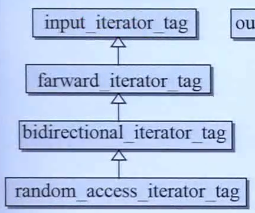

发生哈希碰撞时一般使用链地址法，即对每个bucket，其中有一个链表，相同哈希值的元素串在这个链表中。

篮子(bucket)一开始有一个定量的个数，一旦元素数量超过篮子数量，就进行rehashing，增加篮子数量到两倍附近的质数 。

篮子数量一般为质数。

hashtable内含三个仿函数大小均为1个字节，一个vector(内含三个指针)大小为12字节，一个size_type(unsigned int)大小为4字节，因此一共有19个字节，为了对齐实际上为20个字节。

hashtable的iterator中有两个指针，分别为`node* cur`和`hashtable* ht`，cur指向当前哈希值对应的链表中的某一节点，当cur走到该链表的end()时，使用ht回到控制中心的vector中。

在面对数值(unsigned int, unsigned short, unsigned long,...)时，GCC的hash函数就是把数值本身当成编号返回。

