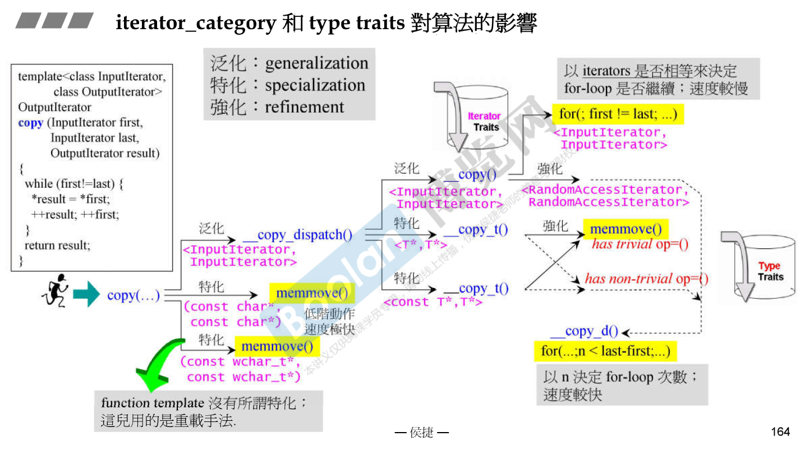

# 迭代器分类对算法的影响

1. array、vector、deque是随机访问迭代器random_access_iterator_tag，

2. forward_list是单向迭代器forward_iterator_tag，

3. list、红黑树实现的set、multiset、map、multimap都是双向迭代器bidirectional_iterator_tag，
4. unordered容器是双向还是单向取决于hashtable中的bucket的链表是单向还是双向的

 

```cpp
  template<typename _InputIterator>
    inline typename iterator_traits<_InputIterator>::difference_type
    __distance(_InputIterator __first, _InputIterator __last,
               input_iterator_tag)
    {
      // concept requirements
      __glibcxx_function_requires(_InputIteratorConcept<_InputIterator>)

      typename iterator_traits<_InputIterator>::difference_type __n = 0;
      while (__first != __last)
	{
	  ++__first;
	  ++__n;
	}
      return __n;
    }

  template<typename _RandomAccessIterator>
    inline typename iterator_traits<_RandomAccessIterator>::difference_type
    __distance(_RandomAccessIterator __first, _RandomAccessIterator __last,
               random_access_iterator_tag)
    {
      // concept requirements
      __glibcxx_function_requires(_RandomAccessIteratorConcept<
				  _RandomAccessIterator>)
      return __last - __first;
    }

  template<typename _InputIterator>
    inline typename iterator_traits<_InputIterator>::difference_type
    distance(_InputIterator __first, _InputIterator __last)
    {
      // concept requirements -- taken care of in __distance
      return std::__distance(__first, __last,
			     std::__iterator_category(__first));
    }
```

当迭代器是随机访问迭代器时，std::distance可以直接通过last-first，时间复杂度为O(1)，否则需要计数器逐个遍历计算距离，时间复杂度为O(n)。

```cpp
  template<typename _InputIterator, typename _Distance>
    inline void
    __advance(_InputIterator& __i, _Distance __n, input_iterator_tag)
    {
      // concept requirements
      __glibcxx_function_requires(_InputIteratorConcept<_InputIterator>)
      _GLIBCXX_DEBUG_ASSERT(__n >= 0);
      while (__n--)
	++__i;
    }

  template<typename _BidirectionalIterator, typename _Distance>
    inline void
    __advance(_BidirectionalIterator& __i, _Distance __n,
	      bidirectional_iterator_tag)
    {
      // concept requirements
      __glibcxx_function_requires(_BidirectionalIteratorConcept<
				  _BidirectionalIterator>)
      if (__n > 0)
        while (__n--)
	  ++__i;
      else
        while (__n++)
	  --__i;
    }

  template<typename _RandomAccessIterator, typename _Distance>
    inline void
    __advance(_RandomAccessIterator& __i, _Distance __n,
              random_access_iterator_tag)
    {
      // concept requirements
      __glibcxx_function_requires(_RandomAccessIteratorConcept<
				  _RandomAccessIterator>)
      __i += __n;
    }
template<typename _InputIterator, typename _Distance>
    inline void
    advance(_InputIterator& __i, _Distance __n)
    {
      // concept requirements -- taken care of in __advance
      typename iterator_traits<_InputIterator>::difference_type __d = __n;
      std::__advance(__i, __d, std::__iterator_category(__i));
    }
```

对于`std::advance`函数：

1. 当迭代器类别是input_iterator，只能向前++
2. 当迭代器类别是双向迭代器，输入的n是正时迭代器++，否则迭代器--
3. 当迭代器是随机访问迭代器时，令当前迭代器i += n

几种迭代器tag使用继承体系的原因是，input_iterator_tag，forward_iterator_tag，bidirectional_iterator_tag和random_access_iterator_tag作为实参都能匹配上input_iterator_tag的形参。同理，forward_iterator_tag，bidirectional_iterator_tag和random_access_iterator_tag都能匹配上forward_iterator_tag的形参；



`std::copy`对不同输入类型的不同特化

